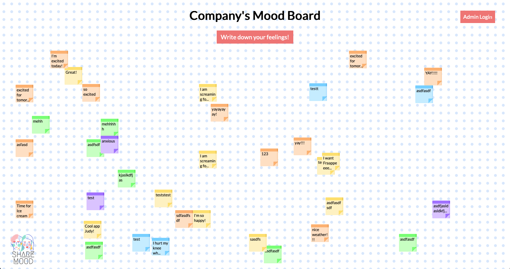

  

With COVID-19 increasing the distance between people and work from home becoming the new norm, growing concerns for mental health have become apparent. According to a survey by TELUS International, 45% of employees felt less healthy mentally while working from home during the pandemic citing feelings of loneliness, anxiety, and depression. How can employers check-in before their employees check out? 

ShareMood is an interactive platform for employees to check-in by anonymously sharing their current mood. Each submission will be posted to a company-wide board where employees can connect and empathize with each other through comments. With unhappy employees reporting to cost the North American economy over $350 billion per year, anonymity will allow employees to express themselves freely and provide valuable insights for managers to act immediately.

## Getting Started
Access the web app [here](https://share-mood.herokuapp.com/)

OR

git clone repo using SSH or HTTP\
*npm install*

To run the web app:\
*node .*

Alternatively for dev purposes:\
*nodemon .*

## How To Use

  

Click the "Write down your feelings!" button to add a sticky to the board.\
Select a Mood by clicking 1 of the 5 emoticon buttons.\
Fill out the "Tell us about your day!" section.

A sticky note will be generated representing your mood and describing your day on the board.\
Sticky notes can be clicked such that a pop-up will appear on screen displaying the message in full.

Only workplace appropriate language is allowed.

Login to Admin dashboard to see aggregated data and charts.

## Technical Pre-requisites
The database URI must be set and used in index.js for the program (and database) to work
